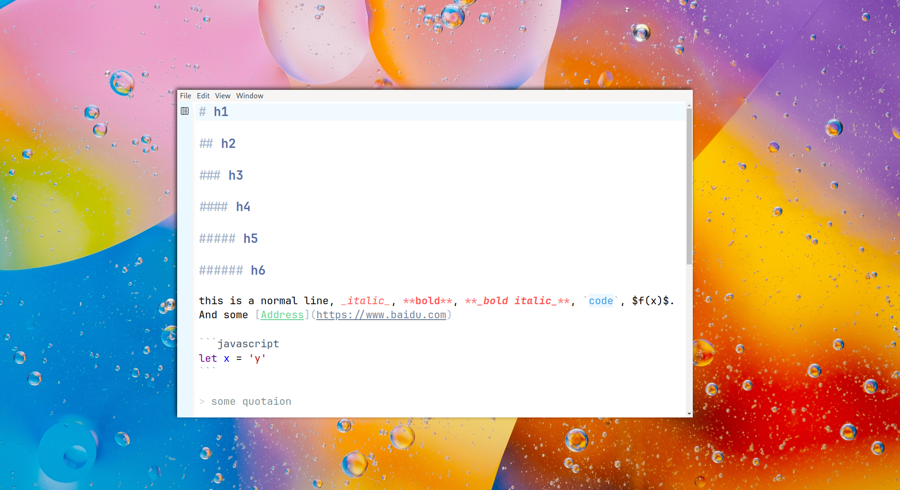
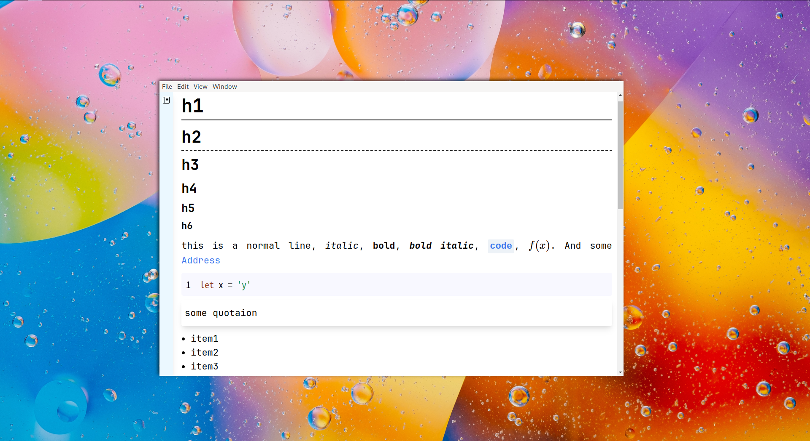
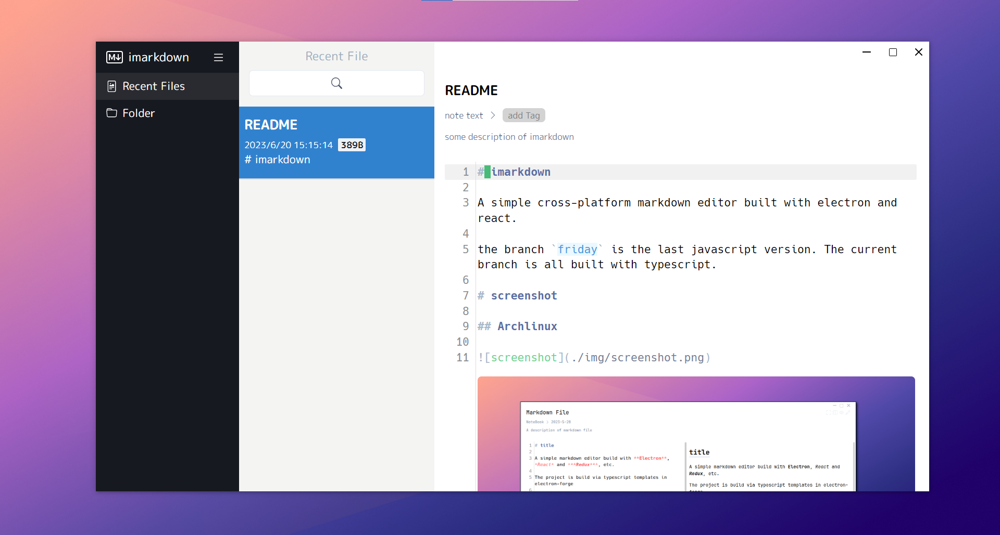
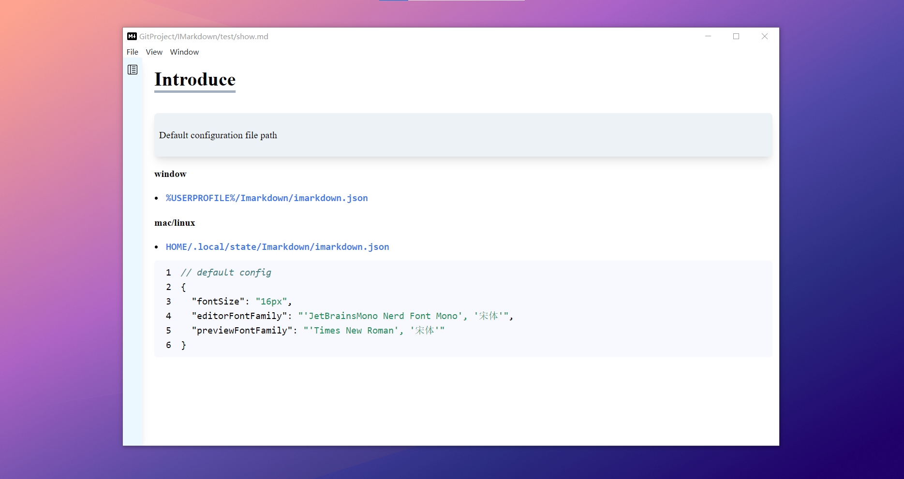

# IMarkdown

Using electron and react to create a simple markdown editor.

# Usage

```shel
git clone https://github.com/ccg1024/IMarkdown.git you-local-project-name
cd you-local-project-name
npm install
npm start
```

# screenshote

**ArchLinux**





**Windows 10**





# Feature

- Vim support

- Telescope-like recent file browsing in vim mode

- Auto format

# LICENCE

GPL3.
