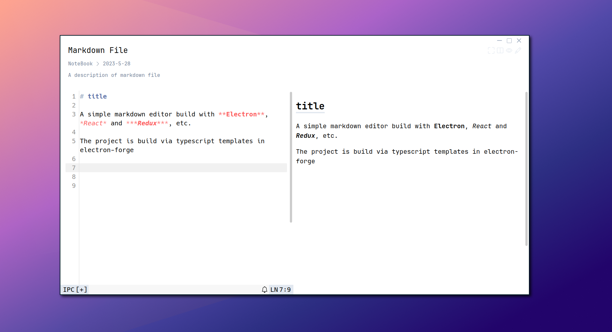
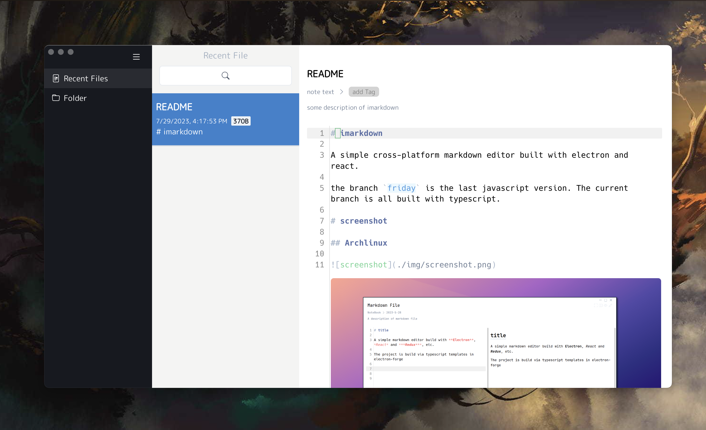
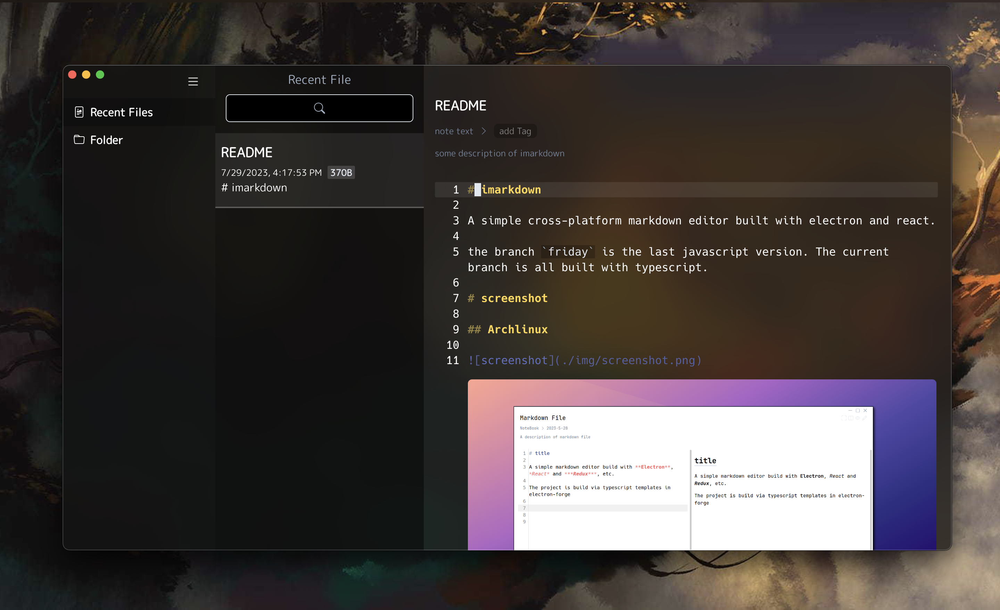

# imarkdown

A simple cross-platform markdown editor built with electron and react.

the branch `friday` is the last javascript version. The current branch is all built with typescript.

# screenshot

## Archlinux

## Macos

### light

### dark

